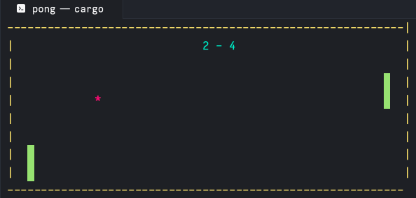

# Bit Blade

Are you bored while you work with your terminal ? Fear not, because your terminal matters ! Introducing our terminal based game engine.
This is a lightweight game engine designed for creating terminal-based games using Rust. It provides simple drawing utilities and keyboard access for developers to easily build interactive games within the terminal environment.

## Features
- **Drawing Utilities:** simple drawing utility for drawing shapes with different styles and colors in terminal.
- **Rust Compatibility:** Built entirely in Rust, leveraging its performance and safety features.

## Examples
Check out the examples directory to see sample usage and get started with building your game. You can find example games built with BitBlade in the `examples` directory.

### Pong game

